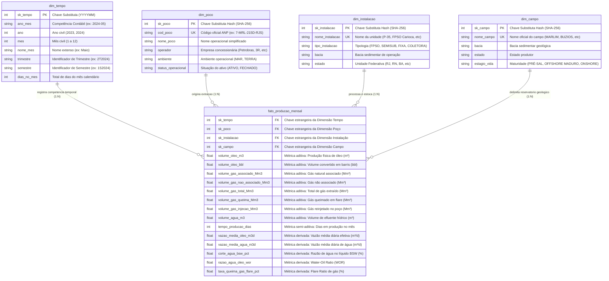

# ARQUITETURA DIMENSIONAL E MODELAGEM DE DADOS: ESQUEMA ESTRELA (STAR SCHEMA)

---

## 1. INTRODUÇÃO E JUSTIFICATIVA DE ENGENHARIA DE DADOS

Para viabilizar o processamento em larga escala e a exploração interativa de séries históricas de produção de petróleo e gás da ANP, adotou-se o **Esquema Estrela (Star Schema)** como padrão de modelagem dimensional no Data Lakehouse (Databricks / Delta Lake).

### Por que o Esquema Estrela e não a Terceira Forma Normal (3NF) ou Snowflake?
1. **Minimização de Shuffle Joins no Apache Spark:** Em arquiteturas distribuídas de nuvem, junções excessivas entre tabelas normalizadas (3NF ou Snowflake profundo) geram tráfego massivo de rede (*shuffle* de partições), degradando severamente o tempo de resposta das consultas analíticas. O Esquema Estrela centraliza as métricas e desnormaliza as dimensões, permitindo *Broadcast Joins* eficientes em memória.
2. **Otimização Colunar em Formato Parquet / Delta:** O formato Delta Lake armazena dados colunarmente. Atributos descritivos na mesma dimensão sofrem compressão com alta taxa de compressão (Snappy/ZSTD) sem custo adicional de redundância em disco.
3. **Ergonomia e Simplicidade Cognitiva para o Decisor:** Reduz a complexidade da redação de consultas SQL por analistas e cientistas de dados, acelerando a fase de Concepção e Inteligência de Simon.

---

## 2. DIAGRAMA VISUAL DO ESQUEMA ESTRELA (MERMAID)

---

## 3. ESPECIFICAÇÃO FORMAL DO GRÃO (GRAIN) E DA TIPOLOGIA DAS MÉTRICAS

### 3.1 Definição do Grão
O grão da tabela fato `fato_producao_mensal` é estritamente **uma medição mensal consolidada de produção fiscalizada para cada poço físico produtor em um determinado mês civil**.
- **Chave Composta Lógica:** `(sk_tempo, sk_poco)` assegura a unicidade factual.
- **Dimensionalidade Múltipla:** Cada fato aponta univocamente para a instalação de superfície que recebe o fluido e para o campo geológico concessionado.

### 3.2 Tipologia das Métricas do Esquema Estrela
1. **Métricas Totalmente Aditivas:**
   - Podem ser somadas ao longo de qualquer dimensão (tempo, campo, bacia, operador).
   - *Exemplos:* `volume_oleo_m3`, `volume_oleo_bbl`, `volume_agua_m3`, `volume_gas_total_Mm3`, `volume_gas_queima_Mm3`.
2. **Métricas Semi-Aditivas:**
   - Não podem ser somadas livremente na dimensão tempo, mas podem ser agregadas por média ou máximo.
   - *Exemplo:* `tempo_producao_dias` (somar dias ao longo de 12 meses resulta em dias-poço, mas a métrica temporal média de disponibilidade exige agregação ponderada).
3. **Métricas Não Aditivas / Derivadas (Intensivas):**
   - Não admitem operação direta de `SUM()` sob pena de produzir distorções matemáticas graves (falácia da média das médias). Devem ser sempre recalculadas a partir das métricas aditivas fundamentais.
   - *Corte de Água (BSW %):* $\text{BSW} = \frac{\sum \text{volume\_agua\_m3}}{\sum (\text{volume\_oleo\_m3} + \text{volume\_agua\_m3})} \times 100$
   - *Taxa de Queima de Gás (Flare %):* $\text{Flare Ratio} = \frac{\sum \text{volume\_gas\_queima\_Mm3}}{\sum \text{volume\_gas\_total\_Mm3}} \times 100$
   - *Vazão Média Diária Efetiva:* $\text{Vazão} = \frac{\sum \text{volume\_oleo\_m3}}{\sum \text{tempo\_producao\_dias}}$

---

## 4. ESTRATÉGIA DE PARTICIONAMENTO E OTIMIZAÇÃO NO LAKEHOUSE
Para viabilizar consultas em sub-segundos no Databricks Delta Lake:
- **Particionamento:** A tabela fato é particionada por `sk_tempo` (ou `ano` / `mes`).
- **Z-Ordering:** Aplicação de `OPTIMIZE fato_producao_mensal ZORDER BY (sk_poco, sk_instalacao)`, garantindo localidade física de dados para filtros frequentes de poço e plataforma.
