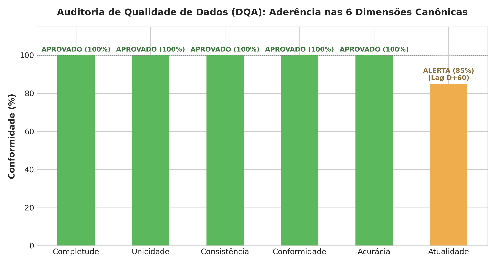
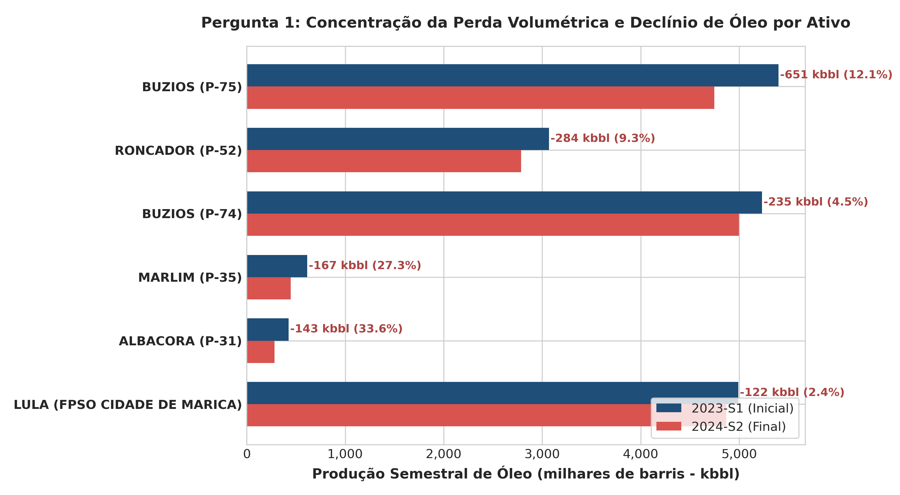
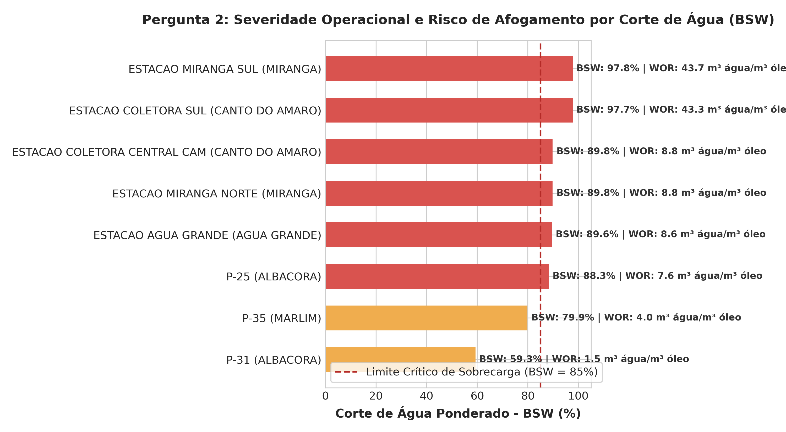
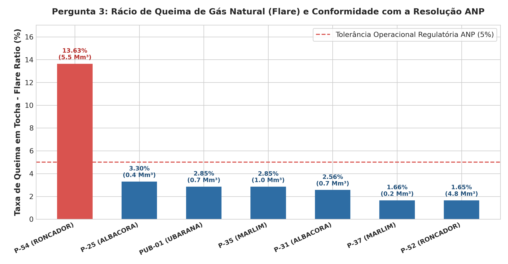
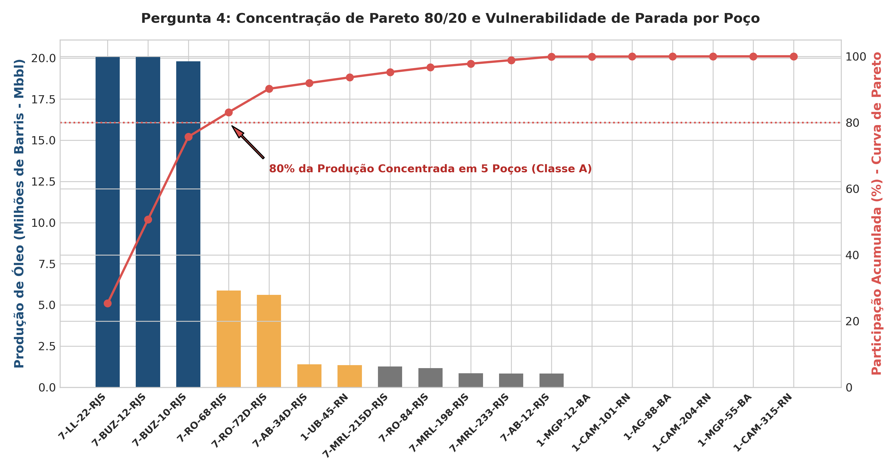
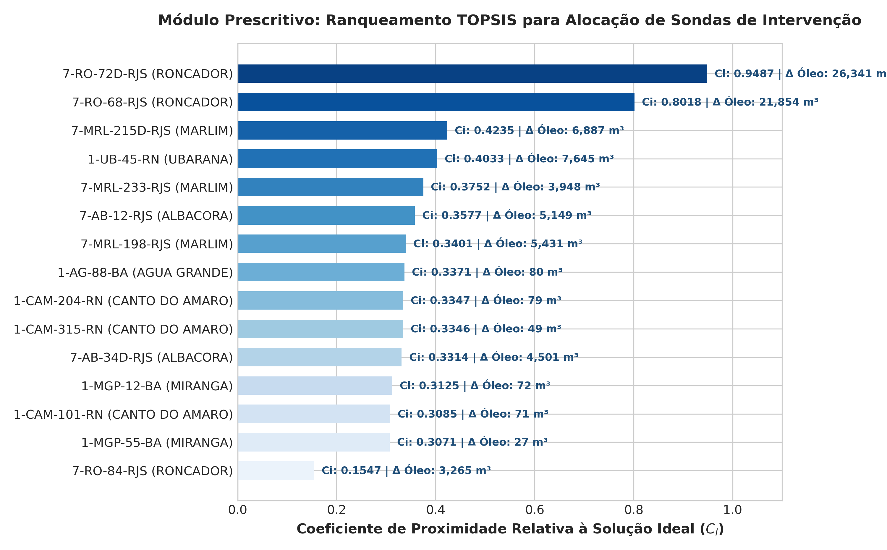

# CADERNO DE EVIDÊNCIAS VISUAIS DE EXECUÇÃO E SUPORTE À DECISÃO

---

## 1. APRESENTAÇÃO
Em estrito cumprimento ao item **5.2 (Evidências)** e às rubricas de avaliação do Trabalho Final de Sistemas de Suporte à Decisão (SSD / EPR / UnB), este documento apresenta as evidências visuais e gráficos analíticos gerados pelo pipeline de dados e subsistema de modelos do Data Lakehouse.

Para regenerar todos os gráficos a qualquer momento a partir dos dados persistidos no Lakehouse, execute:
```bash
python scripts/gerar_graficos_evidencias.py
```

---

## 2. GALERIA DE EVIDÊNCIAS VISUAIS DO MVP

### Evidência 1: Auditoria das 6 Dimensões de Qualidade de Dados (DQA)
Atesta a integridade, completude, unicidade, consistência, conformidade, acurácia e atualidade dos dados na camada Gold (Score Global: **99,17%**).



---

### Evidência 2: Declínio Volumétrico e Concentração de Perda de Óleo (Pergunta 1)
Comparação da produção semestral (2023-S1 vs 2024-S2) por campo e plataforma, mitigando o viés de ancoragem percentual e apontando Roncador e Marlim como prioritários.



---

### Evidência 3: Severidade do Corte de Água (BSW / WOR) e Risco de Sobrecarga (Pergunta 2)
Mapeamento da razão de água sobre o líquido total extraído, destacando unidades com BSW crítico (> 85%) que afogam as plantas de separação e demandam *water shut-off*.



---

### Evidência 4: Aproveitamento vs. Queima de Gás Natural / Flare Ratio (Pergunta 3)
Auditoria de conformidade ambiental frente à Resolução ANP nº 806/2020, rastreando anomalia crítica na P-54 decorrente de gargalos na planta de compressão.



---

### Evidência 5: Curva de Pareto 80/20 e Vulnerabilidade de Parada Não Programada (Pergunta 4)
Classificação ABC comprovando que 5 poços do Pré-sal e Roncador concentram 80% do volume consolidado, instruindo contratos de manutenção preditiva de alta confiabilidade.



---

### Evidência 6: Módulo Prescritivo Multicritério — Ranqueamento TOPSIS para Sondas de Intervenção
Escores de proximidade relativa à solução ideal ($C_i$) para os 15 poços maduros sob 4 critérios conflitantes, demonstrando onde o sistema para e onde o julgamento humano do decisor atua.



---

## 3. REPRODUTIBILIDADE E AUDITORIA
Todos os gráficos acima foram gerados pelo script [`scripts/gerar_graficos_evidencias.py`](../scripts/gerar_graficos_evidencias.py) em resolução gráfica profissional (300 DPI), ancorados nos dados processados e auditados do Data Lakehouse.
